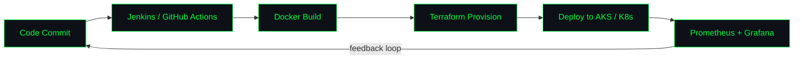

<div align="center">

</div>
<div align="center">
```bash
abhay@devops-insiders:~$ whoami
```
 
```
> ABHAY KUMAR SHUKLA
> role       : DevOps Engineer Intern @ DevOps Insiders (Noida)
> since      : Dec 2025
> focus      : Cloud Infra | CI/CD Automation | IaC | Observability
> secondary  : Generative AI / LLMs / RAG / MLOps
> certified  : AZ-104 (Azure Administrator Associate)
> status     : provisioning infrastructure, breaking pipelines, fixing them again
```
 
</div>
<p align="center">
  
  
  
</p>
---
 
### `$ cat tech-stack.yaml`
 
<p align="center">
  
</p>
<p align="center">
  
  
  
  
  
  
</p>
<p align="center">
  <sub><b>AI/ML (secondary):</b> LLMs · RAG · MLOps basics · NumPy · Pandas · Scikit-learn</sub>
</p>
---
 
### `$ ./deploy-pipeline.sh --visualize`
 

 
---
 
### `$ ls ./projects/`
 
<details>
<summary><b>🟢 Azure Landing Zone Implementation & CI/CD Modernization</b></summary>
<br>
Designed and implemented a Hub-and-Spoke Azure Landing Zone for a BFSI enterprise client to standardize network segregation, governance, and workload isolation across Dev/QA/Prod subscriptions.
 
- Migrated manual infrastructure provisioning to **Terraform**, using reusable modules for VNets, subnets, NSGs, and Load Balancers with remote state managed in Azure Storage.
- Built **Azure DevOps** CI/CD pipelines to build and push Docker images to **ACR** and deploy containerized workloads to **AKS** with environment-based approval gates.
- Configured **Azure Key Vault** for centralized secrets management and **Azure RBAC** for team-based, least-privilege access.
- Set up **Azure Monitor** and **Log Analytics** for pipeline and infrastructure alerting; provided production support for deployment/infra incidents.
- **Result:** ~40% reduction in infrastructure provisioning effort, deployment time cut from hours to under 30 minutes, improved release consistency across environments.
`Tech Stack:` Azure · Azure DevOps · Terraform · AKS · ACR · Docker · Azure Key Vault · Azure Monitor · Log Analytics · RBAC · Git
 
</details>
<details>
<summary><b>🟢 AWS Three-Tier Architecture</b></summary>
<br>
Designed and deployed a highly available three-tier web architecture on AWS.
 
- Created public and private subnets across multiple Availability Zones.
- Configured Application Load Balancer and Auto Scaling Groups.
- Hosted backend services on EC2 and database on Amazon RDS.
- Provisioned complete infrastructure using Terraform.
- Configured CloudWatch monitoring and IAM-based access control.
`Tech Stack:` AWS VPC · EC2 · ALB · Auto Scaling · RDS · S3 · IAM · Route 53 · CloudWatch · Terraform · Git · Linux
 
</details>
<details>
<summary><b>🟢 End-to-End CI/CD Pipeline for Microservices</b></summary>
<br>
Built an automated CI/CD pipeline for containerized microservices.
 
- Integrated **SonarQube** for code quality and **Trivy** for image security scanning.
- Deployed applications to Kubernetes using **Helm** charts.
- Implemented GitOps deployment using **ArgoCD**.
`Tech Stack:` Jenkins · GitHub · Docker · Kubernetes · Helm · ArgoCD · SonarQube · Trivy · Git · Linux · Bash
 
</details>
---
 
### `$ cat certifications.log`
 
<p align="center">
  
  <br>
  
  <br>
  
  <br>
  
</p>
---
 
### `$ ./stats.sh --github`
 
<div align="center">


</div>
---
 
### `$ ./connect.sh`
 
<p align="center">
  <a href="mailto:abhay06072002@gmail.com">
    
  </a>
  <a href="https://github.com/AbhayShukla1907">
    
  </a>
</p>
<div align="center">
```bash
abhay@devops-insiders:~$ echo "Infrastructure as Code. Pipelines that don't break at 2 AM. That's the goal."
```
 

</div>
