<div align="center">


<pre>
<b><font color="#39FF14">abhay@devops</font></b>:<b><font color="#00C6FF">~</font></b>$ whoami
</pre>

# ABHAY KUMAR SHUKLA

### `DevOps Engineer` · `Cloud & Infrastructure Automation` · `AZ-104 Certified`


<br/>

[](https://linkedin.com)
[](mailto:abhay06072002@gmail.com)
[](https://github.com/AbhayShukla1907)

</div>

<br/>

## `$` cat about.txt

```yaml
name:            Abhay Kumar Shukla
role:            DevOps Engineer Intern @ DevOps Insiders, Noida
based_in:        India
education:       B.Tech, Electrical Engineering (2025)
certified:       AZ-104 · AZ-900

currently:
  building:      Azure Landing Zones for BFSI-grade enterprise clients
  learning:      Generative AI · RAG pipelines · MLOps
  impact:        ~40% less provisioning effort | deploys cut to <30 min

philosophy: >
  If I'm doing it manually twice, the third time it becomes a pipeline.
```

<br/>

## `$` ls -la tech-stack/

<div align="center">

**Cloud & Infra**
<br/>


<br/><br/>

**Containers & Orchestration**
<br/>


<br/><br/>

**CI/CD & GitOps**
<br/>


<br/><br/>

**Monitoring & Scripting**
<br/>


</div>

<div align="center">

<br/>


</div>

<br/>

## `$` exec ./deploy-pipeline.sh

```mermaid
graph LR
    A["git push"] --> B["Jenkins / GH Actions"]
    B --> C["SonarQube + Trivy scan"]
    C --> D["Docker build → ACR"]
    D --> E["terraform apply"]
    E --> F["ArgoCD → AKS"]
    F --> G["Prometheus + Grafana"]

    style A fill:#0F0F0F,stroke:#39FF14,color:#39FF14
    style B fill:#0F0F0F,stroke:#D24939,color:#D24939
    style C fill:#0F0F0F,stroke:#4E9BCD,color:#4E9BCD
    style D fill:#0F0F0F,stroke:#2496ED,color:#2496ED
    style E fill:#0F0F0F,stroke:#7B42BC,color:#B583FF
    style F fill:#0F0F0F,stroke:#EF7B4D,color:#EF7B4D
    style G fill:#0F0F0F,stroke:#E6522C,color:#E6522C
```



<br/>

## `$` ls -la projects/

<details open>
<summary><b>🏢 azure-landing-zone/</b> — Hub-and-Spoke Landing Zone for a BFSI enterprise client</summary>
<br/>

Migrated manual infra provisioning to modular **Terraform**. Built **Azure DevOps** pipelines pushing to **ACR** and deploying to **AKS** with environment-based approval gates. Configured **Key Vault**, **RBAC**, and **Monitor/Log Analytics** for centralized secrets and alerting.

> **Impact:** `-40% provisioning effort` · `deploy time: hours → <30 min`

`Azure` `Terraform` `AKS` `ACR` `Key Vault` `RBAC`

</details>

<details>
<summary><b>🌐 aws-three-tier-arch/</b> — Highly available three-tier web architecture</summary>
<br/>

Public/private subnets across multiple Availability Zones, **ALB** + **Auto Scaling** in front of EC2, **RDS** for the database layer — all provisioned via **Terraform** and monitored with **CloudWatch**.

`AWS VPC` `EC2` `ALB` `Auto Scaling` `RDS` `Terraform` `CloudWatch`

</details>

<details>
<summary><b>🔄 microservices-cicd/</b> — End-to-end pipeline for containerized microservices</summary>
<br/>

**Jenkins** pipeline integrating **SonarQube** (code quality) and **Trivy** (image security scanning), deploying to **Kubernetes** via **Helm** charts with **GitOps** delivery through **ArgoCD**.

`Jenkins` `Docker` `Kubernetes` `Helm` `ArgoCD` `SonarQube` `Trivy`

</details>

<br/>

## `$` cat certifications.log

<div align="center">

| status | certification | issuer |
|:---:|---|---|
| ✅ | AZ-104 — Azure Administrator Associate | Microsoft |
| ✅ | AZ-900 — Azure Fundamentals | Microsoft |
| ✅ | DevOps & Cloud Engineering | Hero Vired × Microsoft |
| ✅ | Generative AI for Data, Tech & Finance | Hero Vired × Microsoft |

</div>

<br/>

## `$` ./github-stats.sh --verbose

<div align="center">


<br/>


<br/>


</div>

<br/>


<br/><br/>

<div align="center">

## `$` echo "let's build something reliable"

Open to **DevOps / Cloud / Platform Engineering** roles.
Always up for a conversation about infrastructure, automation, or making deployments boring — in the best way.


</div>
