<div align="center">


<a href="https://linkedin.com">
  
</a>
<a href="mailto:abhay06072002@gmail.com">
  
</a>
<a href="https://github.com/AbhayShukla1907">
  
</a>

<br/>


</div>

<br/>

## 🧭 About Me

```yaml
role: DevOps Engineer Intern @ DevOps Insiders, Noida
focus: [Cloud Infrastructure, CI/CD Automation, IaC, Observability]
currently_building: Azure Landing Zones for BFSI-grade enterprise clients
currently_learning: [Generative AI, RAG pipelines, MLOps]
fun_fact: I treat every manual deployment step as a bug to be automated
```

- 🔭 Currently modernizing CI/CD pipelines and standardizing landing zones on **Azure**
- 🌱 Growing into **Generative AI / LLMs / MLOps** to bring an ML-aware lens to platform engineering
- ⚡ Reduced infra provisioning effort by **~40%** and cut deployment time from hours to **under 30 minutes** on a recent enterprise project
- 🎯 2025 B.Tech grad (Electrical Engineering) → pivoted hard into Cloud & DevOps
- 💬 Ask me about: Terraform modules, AKS/EKS, Jenkins pipelines, or Prometheus/Grafana dashboards

<br/>

## 🧰 Tech Arsenal

<table>
<tr>
<td valign="top" width="50%">

**☁️ Cloud & Infra**
<br/>


**📦 Containers & Orchestration**
<br/>


</td>
<td valign="top" width="50%">

**🔁 CI/CD & GitOps**
<br/>


**📊 Monitoring & Scripting**
<br/>


</td>
</tr>
</table>

<div align="center">


</div>

<br/>

## 🏗️ Infrastructure Pipeline (how I ship)

```mermaid
graph LR
    A[Code Commit] --> B[GitHub Actions / Jenkins]
    B --> C[SonarQube + Trivy Scan]
    C --> D[Docker Build & Push to ACR]
    D --> E[Terraform Apply]
    E --> F[Deploy to AKS via ArgoCD]
    F --> G[Prometheus + Grafana Monitoring]
    style A fill:#0078D4,color:#fff
    style B fill:#D24939,color:#fff
    style C fill:#4E9BCD,color:#fff
    style D fill:#2496ED,color:#fff
    style E fill:#7B42BC,color:#fff
    style F fill:#326CE5,color:#fff
    style G fill:#E6522C,color:#fff
```



<br/>

## 💼 Featured Projects

<table>
<tr>
<td width="33%" valign="top">

### 🏢 Azure Landing Zone
Hub-and-Spoke landing zone for a BFSI client. Modular Terraform, Azure DevOps → AKS via ACR, Key Vault + RBAC, Monitor/Log Analytics.

**Impact:** `-40% provisioning effort` · `<30min deploys`

`Azure` `Terraform` `AKS` `ACR` `RBAC`

</td>
<td width="33%" valign="top">

### 🌐 AWS Three-Tier Architecture
Highly available three-tier web app across multiple AZs — ALB, Auto Scaling, EC2, RDS, fully provisioned via Terraform.

`AWS VPC` `ALB` `RDS` `CloudWatch` `Terraform`

</td>
<td width="33%" valign="top">

### 🔄 Microservices CI/CD
Jenkins pipeline with SonarQube + Trivy scanning, Helm-based K8s deploys, GitOps delivery via ArgoCD.

`Jenkins` `Helm` `ArgoCD` `SonarQube` `Trivy`

</td>
</tr>
</table>

<br/>

## 🎓 Certifications

<div align="center">

| Certification | Issuer |
|---|---|
| 🏅 AZ-104: Azure Administrator Associate | Microsoft |
| 🏅 AZ-900: Azure Fundamentals | Microsoft |
| 📘 DevOps & Cloud Engineering | Hero Vired × Microsoft |
| 🤖 Generative AI for Data, Tech & Finance | Hero Vired × Microsoft |

</div>

<br/>

## 📈 GitHub Analytics

<div align="center">


<br/>


<br/>


</div>

<br/>

<div align="center">

### 🤝 Let's Connect

Open to **DevOps, Cloud, and Platform Engineering** roles — always happy to talk infrastructure, automation, or how to make deployments boring (in a good way).


</div>
